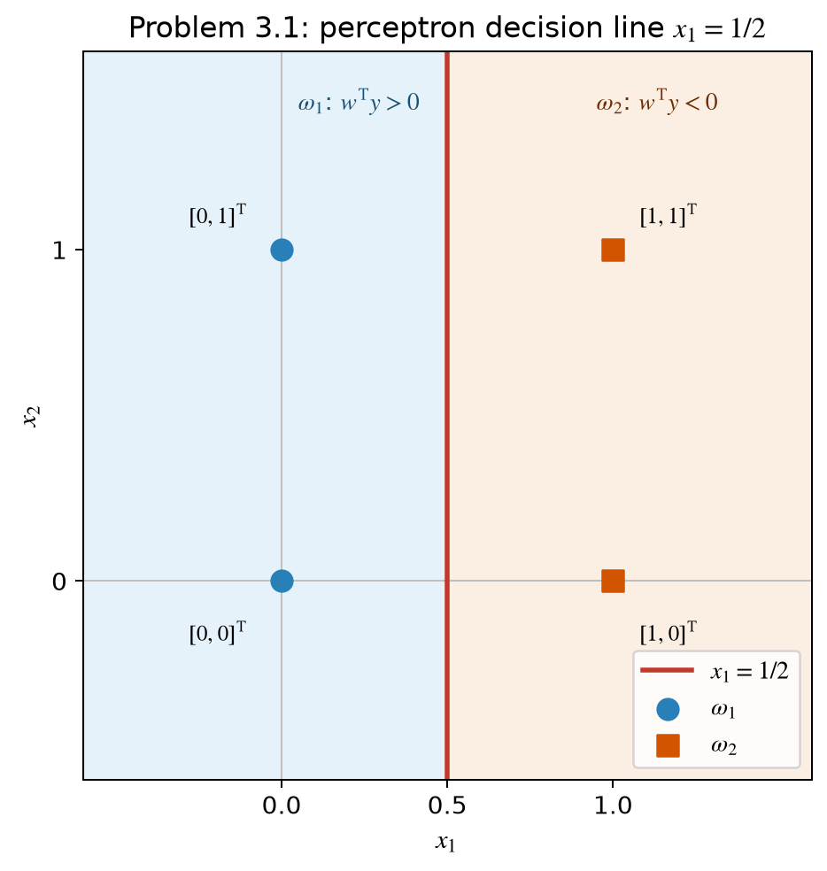
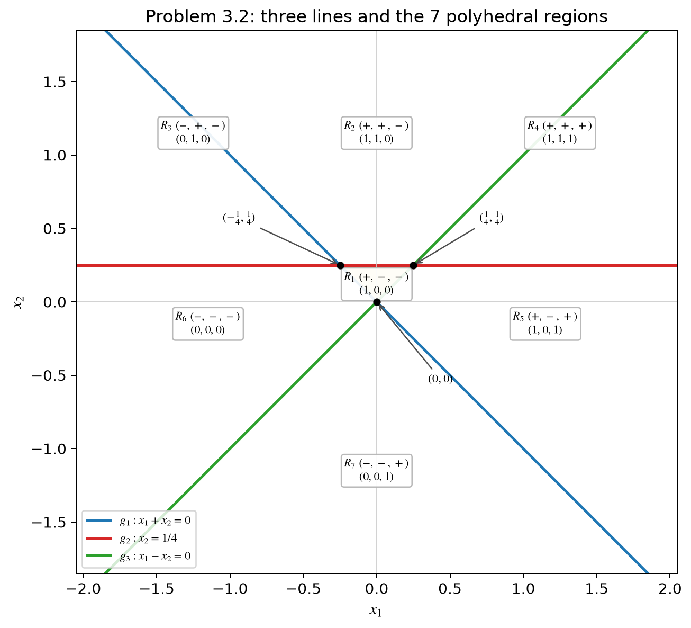
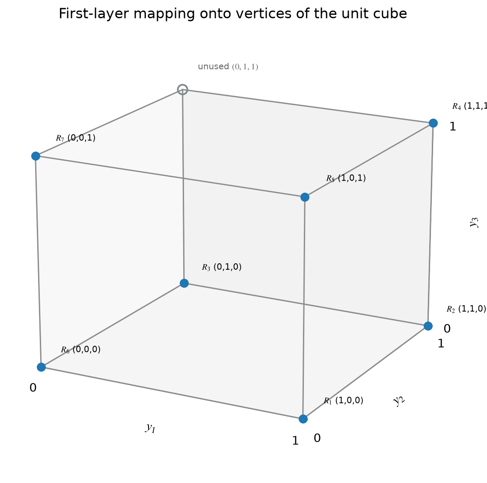

# CISC3024 Pattern Recognition — Homework #1 Solutions

**Name:** ______________________  **Student ID:** ______________________

---

## Problem 3.1  Perceptron (reward-and-punishment form)

### Setup

Class $\omega_1$: $\mathbf{x}^{(1)}=[0,0]^\mathrm{T}$, $\mathbf{x}^{(2)}=[0,1]^\mathrm{T}$  
Class $\omega_2$: $\mathbf{x}^{(3)}=[1,0]^\mathrm{T}$, $\mathbf{x}^{(4)}=[1,1]^\mathrm{T}$  
$\rho=1$.  A line in $\mathbb{R}^2$ that does not pass through the origin needs a threshold, so we work in the **augmented** space of the textbook (Example 3.2):

\[
\mathbf{y}=\begin{bmatrix}x_1\\x_2\\1\end{bmatrix},\qquad
\mathbf{w}=\begin{bmatrix}w_1\\w_2\\w_0\end{bmatrix}.
\]

The given $\mathbf{w}(0)=[0,0]^\mathrm{T}$ is extended to $\mathbf{w}(0)=[0,0,0]^\mathrm{T}$.  
Training vectors:

\[
\mathbf{y}^{(1)}=\begin{bmatrix}0\\0\\1\end{bmatrix},\;
\mathbf{y}^{(2)}=\begin{bmatrix}0\\1\\1\end{bmatrix}
\quad(\omega_1),\qquad
\mathbf{y}^{(3)}=\begin{bmatrix}1\\0\\1\end{bmatrix},\;
\mathbf{y}^{(4)}=\begin{bmatrix}1\\1\\1\end{bmatrix}
\quad(\omega_2).
\]

**Reward-and-punishment rule** (Theodoridis (3.21)–(3.23)):

\[
\mathbf{w}(t+1)=\begin{cases}
\mathbf{w}(t)+\rho\,\mathbf{y}(t), & \mathbf{y}(t)\in\omega_1\text{ and }\mathbf{w}^\mathrm{T}(t)\mathbf{y}(t)\le 0,\\[4pt]
\mathbf{w}(t)-\rho\,\mathbf{y}(t), & \mathbf{y}(t)\in\omega_2\text{ and }\mathbf{w}^\mathrm{T}(t)\mathbf{y}(t)\ge 0,\\[4pt]
\mathbf{w}(t), & \text{otherwise (correctly classified)}.
\end{cases}
\]

Decision: $\mathbf{w}^\mathrm{T}\mathbf{y}>0\Rightarrow\omega_1$, $\mathbf{w}^\mathrm{T}\mathbf{y}<0\Rightarrow\omega_2$.

Samples are presented cyclically in the order $\mathbf{y}^{(1)},\mathbf{y}^{(2)},\mathbf{y}^{(3)},\mathbf{y}^{(4)}$.

### Iteration

| step | sample | $\mathbf{w}^\mathrm{T}\mathbf{y}$ | action | $\mathbf{w}$ after update |
|:---:|:---|:---:|:---|:---|
| 0 | — | — | initialize | $[0,0,0]^\mathrm{T}$ |
| 1 | $\mathbf{y}^{(1)}\in\omega_1$ | $0\le 0$ | $\mathbf{w}\leftarrow\mathbf{w}+\mathbf{y}^{(1)}$ | $[0,0,1]^\mathrm{T}$ |
| 2 | $\mathbf{y}^{(2)}\in\omega_1$ | $1>0$ | none | $[0,0,1]^\mathrm{T}$ |
| 3 | $\mathbf{y}^{(3)}\in\omega_2$ | $1\ge 0$ | $\mathbf{w}\leftarrow\mathbf{w}-\mathbf{y}^{(3)}$ | $[-1,0,0]^\mathrm{T}$ |
| 4 | $\mathbf{y}^{(4)}\in\omega_2$ | $-1<0$ | none | $[-1,0,0]^\mathrm{T}$ |
| 5 | $\mathbf{y}^{(1)}\in\omega_1$ | $0\le 0$ | $\mathbf{w}\leftarrow\mathbf{w}+\mathbf{y}^{(1)}$ | $[-1,0,1]^\mathrm{T}$ |
| 6 | $\mathbf{y}^{(2)}\in\omega_1$ | $1>0$ | none | $[-1,0,1]^\mathrm{T}$ |
| 7 | $\mathbf{y}^{(3)}\in\omega_2$ | $0\ge 0$ | $\mathbf{w}\leftarrow\mathbf{w}-\mathbf{y}^{(3)}$ | $[-2,0,0]^\mathrm{T}$ |
| 8 | $\mathbf{y}^{(4)}\in\omega_2$ | $-2<0$ | none | $[-2,0,0]^\mathrm{T}$ |
| 9 | $\mathbf{y}^{(1)}\in\omega_1$ | $0\le 0$ | $\mathbf{w}\leftarrow\mathbf{w}+\mathbf{y}^{(1)}$ | $[-2,0,1]^\mathrm{T}$ |
| 10 | $\mathbf{y}^{(2)}\in\omega_1$ | $1>0$ | none | $[-2,0,1]^\mathrm{T}$ |
| 11 | $\mathbf{y}^{(3)}\in\omega_2$ | $-1<0$ | none | $[-2,0,1]^\mathrm{T}$ |
| 12 | $\mathbf{y}^{(4)}\in\omega_2$ | $-1<0$ | none | $[-2,0,1]^\mathrm{T}$ |
| 13–16 | all four | $+1,+1,-1,-1$ | none | **converged** |

### Result

\[
\mathbf{w}=[-2,\,0,\,1]^\mathrm{T}.
\]

The separating line is

\[
-2x_1+1=0\qquad\Leftrightarrow\qquad x_1=\frac12.
\]

Verification:

- $\omega_1$: $-2\cdot 0+1=1>0$, $-2\cdot 0+1=1>0$
- $\omega_2$: $-2\cdot 1+1=-1<0$, $-2\cdot 1+1=-1<0$

---

## Problem 3.2  Multilayer perceptron on three lines

### The three lines (first hidden layer)

Use the unit-step activation $f(v)=1$ if $v\ge 0$ and $f(v)=0$ if $v<0$.  
The first layer realizes the given lines by three neurons

\begin{align*}
g_1(\mathbf{x})&=x_1+x_2, &
y_1&=f(g_1),\\
g_2(\mathbf{x})&=x_2-\tfrac14, &
y_2&=f(g_2),\\
g_3(\mathbf{x})&=x_1-x_2, &
y_3&=f(g_3).
\end{align*}

Augmented synaptic weights of the first layer (including the threshold as the last component):

\[
\mathbf{w}_1^{(1)}=\begin{bmatrix}1\\1\\0\end{bmatrix},\quad
\mathbf{w}_2^{(1)}=\begin{bmatrix}0\\1\\-1/4\end{bmatrix},\quad
\mathbf{w}_3^{(1)}=\begin{bmatrix}1\\-1\\0\end{bmatrix}.
\]

Intersection points of the three lines:

\[
g_1=g_2=0 \Rightarrow \Bigl(-\tfrac14,\tfrac14\Bigr),\quad
g_1=g_3=0 \Rightarrow (0,0),\quad
g_2=g_3=0 \Rightarrow \Bigl(\tfrac14,\tfrac14\Bigr).
\]

They form a triangle. Three lines in this arrangement partition $\mathbb{R}^2$ into **7** polyhedra (not 8: the sign pattern $(-,+,+)$ is geometrically impossible, because $x_2>1/4$ and $x_1>x_2$ already imply $x_1+x_2>1/2>0$).

### Mapping of each polyhedron onto a cube vertex

$+$ means $g_i\ge 0$ (neuron output $1$), $-$ means $g_i<0$ (output $0$).

| region | location (test point) | $(g_1,g_2,g_3)$ | cube vertex $(y_1,y_2,y_3)$ |
|:---:|:---|:---:|:---:|
| $R_1$ | interior of the triangle, e.g. $(0,1/8)$ | $(+,-,-)$ | $(1,0,0)$ |
| $R_2$ | above the triangle, e.g. $(0,1)$ | $(+,+,-)$ | $(1,1,0)$ |
| $R_3$ | upper-left, e.g. $(-2,1)$ | $(-,+,-)$ | $(0,1,0)$ |
| $R_4$ | upper-right, e.g. $(2,1)$ | $(+,+,+)$ | $(1,1,1)$ |
| $R_5$ | lower-right, e.g. $(1,-0.2)$ | $(+,-,+)$ | $(1,0,1)$ |
| $R_6$ | lower-left, e.g. $(-1,-0.2)$ | $(-,-,-)$ | $(0,0,0)$ |
| $R_7$ | bottom wedge, e.g. $(0,-1)$ | $(-,-,+)$ | $(0,0,1)$ |

Unused vertex: $(0,1,1)$.

A **two-layer** network (one hidden layer + output) can classify a union of these polyhedra **if and only if** the corresponding cube vertices are linearly separable.  
A **three-layer** network (two hidden layers + output) can classify **any** union, by isolating each class-$A$ vertex and OR-ing them.

---

### (a) Two-layer network is sufficient

Assign the four vertices of the face $y_3=0$ to $\omega_1$ and the remaining realized vertices to $\omega_2$:

\[
\begin{align*}
\omega_1 &= R_6\cup R_1\cup R_3\cup R_2
         = \{(0,0,0),(1,0,0),(0,1,0),(1,1,0)\},\\
\omega_2 &= R_7\cup R_5\cup R_4
         = \{(0,0,1),(1,0,1),(1,1,1)\}.
\end{align*}
\]

Geometrically this is the half-plane $x_1<x_2$ versus $x_1>x_2$.  
In the $y$-space the two sets lie on opposite sides of the plane $y_3=1/2$, so one output neuron is enough:

\[
g^{(2)}(\mathbf{y})=-y_3+\tfrac12,\qquad
\mathbf{w}^{(2)}=\begin{bmatrix}0\\0\\-1\\1/2\end{bmatrix}.
\]

($g^{(2)}\ge 0\Rightarrow\omega_1$, $g^{(2)}<0\Rightarrow\omega_2$.)

**First-layer weights** as above; **output-layer weights** $\mathbf{w}^{(2)}=[0,0,-1,1/2]^\mathrm{T}$.

(Any other linearly separable partition also works, e.g. splitting on $y_2=1/2$, which is the original line $x_2=1/4$.)

---

### (b) Three-layer network is necessary

Take two **opposite** cube vertices (the 3-D XOR configuration):

\[
\omega_1=R_6\cup R_4=\{(0,0,0),(1,1,1)\},\qquad
\omega_2=\text{the other five realized vertices}.
\]

No plane can put $(0,0,0)$ and $(1,1,1)$ on one side and all remaining cube vertices on the other (their convex hulls intersect at the cube centre $(1/2,1/2,1/2)$). Hence a two-layer net cannot solve this dichotomy and a second hidden layer is required.

Follow the constructive argument of the textbook (Sec. 4.4):

1. First hidden layer: the same three neurons as above (form the hyperplanes / cube mapping).
2. Second hidden layer: two neurons, each isolating one $\omega_1$ vertex.
3. Output neuron: OR gate.

**Isolate $(0,0,0)$** (output $1$ only there):

\[
z_1=f\bigl(-y_1-y_2-y_3+\tfrac12\bigr),\qquad
\mathbf{w}_1^{(2)}=\begin{bmatrix}-1\\-1\\-1\\1/2\end{bmatrix}.
\]

Check: $g=- (y_1+y_2+y_3)+1/2 \ge 0$ iff $y_1+y_2+y_3=0$, i.e. only at $(0,0,0)$.

**Isolate $(1,1,1)$** (output $1$ only there):

\[
z_2=f\bigl(y_1+y_2+y_3-\tfrac52\bigr),\qquad
\mathbf{w}_2^{(2)}=\begin{bmatrix}1\\1\\1\\-5/2\end{bmatrix}.
\]

Check: $g=y_1+y_2+y_3-5/2\ge 0$ iff $y_1+y_2+y_3=3$, i.e. only at $(1,1,1)$.

Then

\[
(0,0,0)\mapsto(z_1,z_2)=(1,0),\quad
(1,1,1)\mapsto(0,1),\quad
\text{all other vertices}\mapsto(0,0).
\]

**Output OR neuron:**

\[
g^{(3)}=z_1+z_2-\tfrac12,\qquad
\mathbf{w}^{(3)}=\begin{bmatrix}1\\1\\-1/2\end{bmatrix}.
\]

$g^{(3)}\ge 0$ precisely when at least one of $z_1,z_2$ is $1$, i.e. precisely on $\omega_1$.

### Summary of all synaptic weights for (b)

| layer | neuron | augmented weight (last entry = threshold $w_0$) |
|:---|:---|:---|
| 1 | $y_1$ | $[1,\;1,\;0]^\mathrm{T}$ |
| 1 | $y_2$ | $[0,\;1,\;-1/4]^\mathrm{T}$ |
| 1 | $y_3$ | $[1,\;-1,\;0]^\mathrm{T}$ |
| 2 | $z_1$ (cut off $(0,0,0)$) | $[-1,\;-1,\;-1,\;1/2]^\mathrm{T}$ |
| 2 | $z_2$ (cut off $(1,1,1)$) | $[1,\;1,\;1,\;-5/2]^\mathrm{T}$ |
| 3 | output (OR) | $[1,\;1,\;-1/2]^\mathrm{T}$ |

Architecture: $2$ inputs — $3$ neurons — $2$ neurons — $1$ output.
